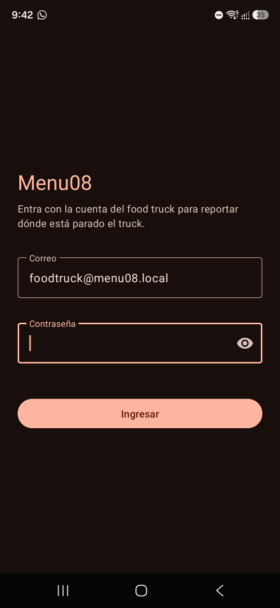
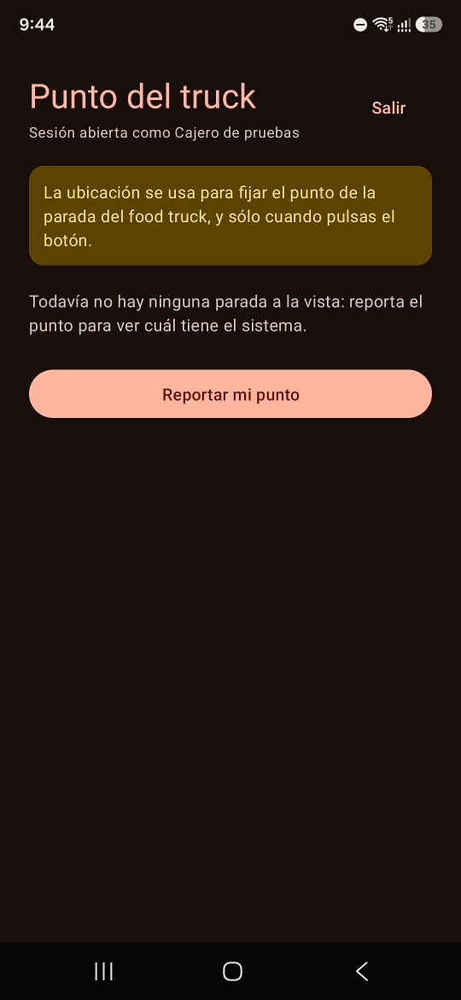
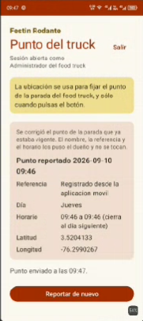
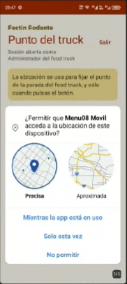
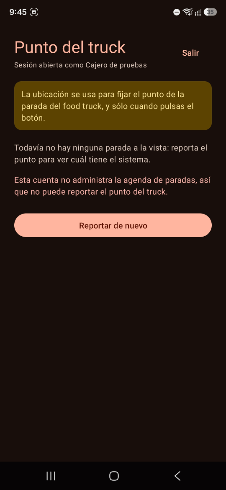

# Manual de uso de la aplicación móvil

Cómo se usa la aplicación del módulo móvil de Menu08 desde el teléfono. Son dos pantallas y un
botón; este manual recorre las dos, explica qué hace exactamente el botón y qué hacer ante cada
mensaje que puede salir.

Las capturas son del dispositivo donde se probó el APK, un **TECNO BG7 con Android 13**. Unas salen
en claro y otras en oscuro porque **la aplicación sigue el tema del teléfono**: no tiene interruptor
propio ni hace falta.

## Para quién

La aplicación la usa **quien atiende el food truck**, con la cuenta de rol `food_truck` de su
negocio. Las demás cuentas —`cajero`, `produccion` y `plataforma`— **entran igual**, pero al pulsar
el botón reciben un aviso: la agenda de paradas la administra solo el food truck. No es un descuido,
es deliberado: así la aplicación puede decir *«esta cuenta no administra la agenda»* en vez de
*«Correo o contraseña incorrectos.»*, que sería mentira.

---

## 1 · Entrar



Se escribe el correo y la contraseña de la cuenta del food truck y se pulsa **Ingresar**. La tecla
de acción del teclado hace lo mismo, para no tener que buscar el botón después de teclear.

> En la captura el correo aparece ya escrito porque es el del último ingreso, que la aplicación
> recuerda. El de la imagen es una cuenta de demostración del proyecto; cada truck entra con la suya.

Tres cosas que conviene saber:

- **El correo se recuerda**, la contraseña no. Es lo único que la aplicación guarda en el teléfono, y
  solo tras un ingreso correcto: memorizar uno equivocado sería memorizar justo el que no conviene
  volver a ofrecer.
- **La sesión vive en memoria y muere con la aplicación**, así que no queda nada guardado en el
  teléfono. Pero dejarla al fondo no la cierra: al volver desde Recientes sigue abierta. **Antes de
  pasarle el teléfono a otra persona hay que pulsar Salir.**
- La sesión **dura dos horas contadas desde el ingreso**, se use o no: el permiso con el que la
  aplicación reporta se sella al entrar y no se renueva reportando. Pasadas esas dos horas hay que
  volver a entrar aunque se haya estado usando todo el rato. **La aplicación no lo sabe hasta que lo
  intenta**: la pantalla del punto se queda igual, y es al pulsar el botón cuando el servidor la
  rechaza y entonces se vuelve aquí, con el correo puesto y explicando por qué.

## 2 · La pantalla del punto



Arriba, en dorado, **el nombre del food truck**. Es el dato que hay que mirar antes de pulsar nada:
dice sobre qué negocio se va a reportar. Debajo, el título y con qué cuenta se entró.

> Esta captura es de una compilación anterior y por eso empieza directamente por «Punto del truck».
> El nombre del negocio se ve en las dos capturas de las secciones 3 y 4.

> **Comprobar el nombre del truck no es una formalidad.** Durante las pruebas del módulo, dos
> reportes acabaron en la agenda real de otro food truck por entrar con la cuenta equivocada: los
> nombres con que saluda la aplicación se parecían —«Administrador del food truck» y «Administrador
> de pruebas»— y no había ningún otro dato en pantalla que dijera sobre qué negocio se reportaba. El
> nombre del truck está ahí justamente por eso.

A la derecha del todo, **Salir**, que cierra la sesión y vuelve al ingreso. Es lo que hay que pulsar
antes de pasarle el teléfono a otra persona.

Bajo la cabecera va la explicación de para qué se usa la ubicación. Debajo, la ficha de la parada
—o, mientras no se haya reportado nada en esta sesión, el aviso *«Todavía no hay ninguna parada a la
vista: reporta el punto para ver cuál tiene el sistema.»*—, después los avisos que haya, la hora del
último envío y, cerrando la pantalla, el botón grande: **Reportar mi punto**.

## 3 · Qué hace el botón

Al pulsarlo, la aplicación pide el permiso de ubicación si aún no lo tiene, lee el punto del GPS y lo
envía al servidor. Con el punto en la mano, **el servidor hace una de dos cosas**, y la pantalla dice
cuál:

| Situación | Qué pasa | Mensaje |
|---|---|---|
| **Hay una parada vigente** en este día y esta hora | Se **actualizan su latitud y su longitud**. El nombre, la referencia, el día y el horario los puso el dueño desde el panel y no se tocan | *«Se corrigió el punto de la parada que ya estaba vigente. El nombre, la referencia y el horario los puso el dueño y no se tocan.»* |
| **No hay ninguna parada vigente** | Se **registra una parada nueva** con el punto actual, vigente desde ese mismo momento y durante las 24 horas siguientes | *«No había ninguna parada vigente: se registró una parada nueva con este punto.»* |

Debajo aparece la ficha de la parada que quedó registrada —nombre, referencia, día, horario, latitud
y longitud— y la hora del envío.



En esa captura se ven las dos cosas a la vez: la ficha de la parada que quedó registrada y, debajo,
la confirmación **«Punto enviado a las 09:47.»** Su horario, *«09:46 a 09:46 (cierra al día
siguiente)»*, es el de una parada creada por el propio reporte.

Que la parada nueva quede vigente 24 horas tiene una razón: **así el siguiente reporte la corrige en
vez de crear otra**. Sin eso, cada pulsación del botón sembraría una parada más en la agenda.

**Pero la parada no desaparece al día siguiente.** Queda en la agenda como una parada más, con su
día de la semana, y vuelve a estar vigente ese mismo día a esa hora **todas las semanas** hasta que
alguien la desactive. Se reconoce en la ficha porque su horario va de una hora a esa misma hora, con
la nota *(cierra al día siguiente)*. Si fue un reporte de una sola vez, conviene desactivarla desde
el panel web, en **Paradas**.

## 4 · El permiso de ubicación

La primera vez que se pulsa el botón, Android pregunta si la aplicación puede usar la ubicación.



Hay que conceder **«Mientras la app está en uso»**. La aplicación no vigila la ubicación por su
cuenta: no hay servicio en segundo plano, no pide el permiso de ubicación en segundo plano, y **nada
se escribe en el almacenamiento del teléfono**. El punto se lee al pulsar el botón —si el GPS no
responde en veinte segundos se usa el último punto que conozca el teléfono, siempre que tenga menos
de dos minutos— y se manda al servidor. Solo se queda en memoria si el envío falla por falta de red,
para poder reintentarlo.

Si se deniega, la aplicación lo dice y el botón sigue ahí para volver a intentarlo. **Desde Android
11, si se deniega dos veces el sistema deja de preguntar** y hay que concederlo a mano; la pantalla
ofrece entonces un botón que abre directamente los ajustes de la aplicación. Si el teléfono no tiene
esa pantalla, la aplicación lo dice y hay que abrirlos a mano.

---

## 5 · Qué hacer ante cada mensaje

Los textos son los de la aplicación, copiados uno a uno de
[`aplicacion/src/main/res/values/strings.xml`](../aplicacion/src/main/res/values/strings.xml). Donde
aquí se lee **(N)**, en la pantalla sale el número del código que devolvió el servidor.

### Al entrar

| Mensaje | Qué pasó | Qué hacer |
|---|---|---|
| **Correo o contraseña incorrectos.** | El correo no existe, la contraseña no es ésa, o la cuenta está desactivada. El servidor no distingue los tres a propósito: decirlo delataría qué cuentas existen | Revisar el correo y volver a teclear la contraseña. Si sigue, pedir al administrador que confirme que la cuenta está activa |
| **Escribe tu correo.** · **El correo tiene que llevar una arroba.** · **Escribe tu contraseña.** | La aplicación cortó antes de salir a la red | Completar el campo que falta |
| **Faltan el correo o la contraseña.** | Llegó al servidor con un campo vacío | Completar los dos campos |
| **No se pudo conectar con adso.menu08.com. Revisa la conexión e inténtalo de nuevo.** | No hubo respuesta: sin datos, sin cobertura o el servidor no responde | Comprobar la conexión del teléfono y reintentar |
| **El servidor respondió con un error (N). Vuelve a intentarlo en un momento.** | Algo falló en el servidor | Esperar un momento y reintentar. Si se repite, avisar a quien administra el sitio, dando el número |

### Al reportar el punto

Así se ve el aviso de una cuenta que entra pero no administra la agenda:



| Mensaje | Qué pasó | Qué hacer |
|---|---|---|
| **Esta cuenta no administra la agenda de paradas, así que no puede reportar el punto del truck.** | Se entró con una cuenta que no es de `food_truck`: `cajero`, `produccion` o `plataforma` | Salir y entrar con la cuenta del food truck. **La sesión no se cierra sola**: sigue abierta |
| **Sin el permiso de ubicación no hay punto que reportar. Pulsa el botón para concederlo.** | Se denegó el permiso | Pulsar otra vez y conceder «Mientras la app está en uso» |
| **El permiso de ubicación quedó denegado para siempre, así que el sistema ya no lo va a preguntar: hay que concederlo a mano.** | Se denegó dos veces y Android dejó de preguntar | Pulsar **Abrir los ajustes de la aplicación** y conceder la ubicación desde ahí |
| **La ubicación del teléfono está apagada y no hay de dónde leer el punto.** | El permiso está concedido, pero la ubicación del teléfono está apagada | Pulsar **Abrir los ajustes de ubicación** y encenderla |
| **El permiso concedido es sólo de ubicación aproximada: el punto puede quedar a unas manzanas del truck.** | Se concedió la ubicación aproximada y no la precisa | El punto se envía igual. Para más precisión, conceder la ubicación precisa desde los ajustes |
| **No se obtuvo un punto reciente. Vuelve a intentarlo.** | No llegó ninguna posición utilizable: el GPS no fijó en veinte segundos, o el proveedor se rindió antes, o la única posición que conocía el teléfono tenía más de dos minutos. Pasa bajo techo o en la primera lectura tras encender la ubicación | Salir a cielo abierto y reintentar |
| **No se pudo enviar el punto, pero quedó guardado: pulsa el botón para reintentar el envío sin volver a leer el GPS.** | Se leyó el punto pero no se pudo enviar: sin datos o sin cobertura | Recuperar la conexión y **volver a pulsar el botón**: reenvía el mismo punto sin volver a leer el GPS |
| **Este dispositivo no tiene esa pantalla de ajustes. Ábrelos a mano desde el teléfono.** | Se pulsó uno de los dos botones de ajustes de los avisos y este teléfono no tiene esa pantalla | Abrir a mano **Ajustes › Aplicaciones › Menu08 Movil › Permisos**, o **Ajustes › Ubicación** |
| **La sesión caducó. Vuelve a ingresar.** | Pasaron más de dos horas desde el ingreso | La aplicación vuelve al ingreso con el correo puesto. Teclear la contraseña |
| **El servidor respondió con un error (N). Vuelve a intentarlo en un momento.** | Algo falló en el servidor | Reintentar. Si se repite, avisar dando el número |

**El punto capturado solo queda guardado cuando el fallo fue de red**, que es el caso del mensaje
que dice «quedó guardado»: entonces el botón lo reenvía sin volver a leer el GPS. Si el servidor
llega a contestar —aunque sea con un error—, el punto se descarta y la siguiente pulsación vuelve a
leer el GPS.

---

## Sobre las capturas

Las cinco están en [`imagenes/`](imagenes) y salen del TECNO BG7 con Android 13 donde se probó el
APK, el mismo de [`pruebas-movil-dispositivo.md`](pruebas-movil-dispositivo.md).

| Archivo | Qué enseña |
|---|---|
| `pantalla_ingreso.png` | El formulario de entrada |
| `pantalla_ubicacion.png` | La pantalla del punto antes de reportar nada |
| `permiso_ubicacion.png` | El diálogo del permiso de ubicación de Android |
| `parada_vigente.png` | La ficha de la parada y la confirmación del envío |
| `mensaje_rol_no_autorizado.png` | El aviso de una cuenta que no administra la agenda |

Dos detalles que explican lo que se ve y no se ve en ellas:

- **La cabecera con el nombre del food truck en dorado** sale en las dos capturas en claro, que son
  las más recientes. Las tres en oscuro se tomaron con una compilación anterior a ese cambio, así que
  ahí la cabecera empieza directamente por «Punto del truck».
- **Las dos en claro están a menor resolución** que las otras tres. Se dejan porque son las que
  enseñan lo que ninguna otra enseña —el diálogo del permiso y la ficha ya rellenada—, y se pueden
  reemplazar por capturas nuevas sin tocar el manual: basta con guardarlas con el mismo nombre.

Para volver a tomarlas, con el teléfono conectado por USB y la depuración activada:

```bash
adb exec-out screencap -p > docs/imagenes/pantalla_ingreso.png
```

Y para ver otra vez el diálogo del permiso desde cero, `adb shell pm clear com.menu08.movil`, que
borra además el correo recordado.

> **Al tomarlas, entrar con la cuenta de pruebas y no con la de demostración.** Un reporte se guarda
> de verdad: si cae dentro de la franja de una parada real, le cambia las coordenadas sin dejar
> rastro. Y las capturas enseñan el nombre del truck, la cuenta y la posición real del teléfono, así
> que conviene mirarlas antes de subirlas.
